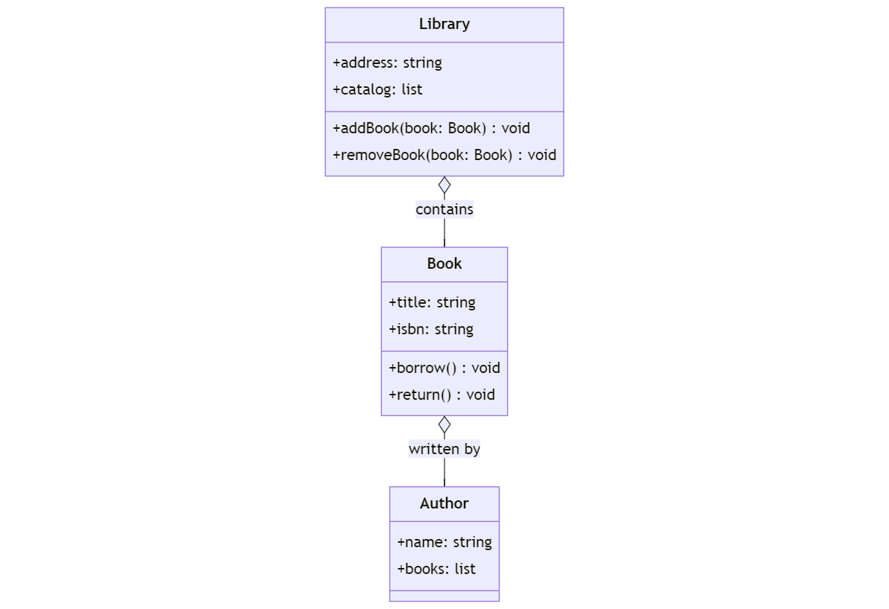
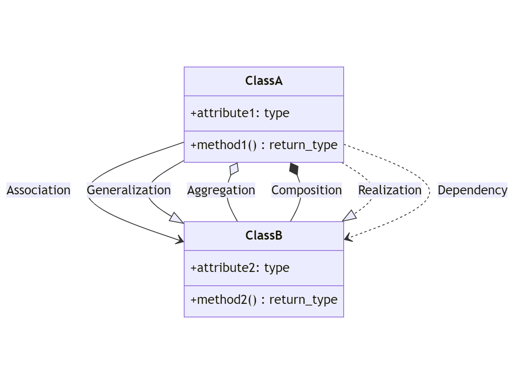

# OOP - Introduction to UML Public

## Introduction to UML for OOP in Python
If you’ve dabbled in Object-Oriented Programming (OOP) with Python, you’ve already taken a significant step in the world of software design. Now, let’s introduce a powerful tool that can help visualize and design your OOP concepts: the Unified Modeling Language (UML).

## What is UML?
UML stands for Unified Modeling Language. It’s a standardized way to visualize the design of a system. Think of it as a blueprint for your code, much like architectural blueprints for buildings.

## Why UML for Python OOP?
While Python is known for its readability, as your projects grow, it becomes crucial to have a clear structure and design. UML diagrams can help:

+ Visualize the relationships between classes and objects.
+ Plan before diving into coding, saving potential refactoring time.
+ Communicate your design ideas with teammates effectively.

## Common UML Diagrams in OOP:
+ Class Diagrams: Show the static structure of the system’s classes, their attributes, methods, and relationships.
+ Sequence Diagrams: Illustrate how objects interact with each other in a sequence of messages and operations.
+ Use Case Diagrams: Represent the functionality of a system using actors and their interactions.

### A Simple Example:
Imagine you’re building a library system. You might have classes like Book, Author, and Library. A class diagram would show these classes, their attributes (like title for Book), their methods (like borrow()), and how they relate (e.g., an Author can have multiple Books).

In the diagram:

### Book:

+ Represents a book with attributes like title and isbn.
+ Has methods to borrow and return the book.
+ Each book is associated with an Author, indicating the “written by” relationship.

### Author:
+ Represents an author with a name.
+ Has a list of books they’ve written.

### Library:
+ Represents a library with an address.
+ Contains a catalog of books.
+ Has methods to addBook and removeBook to manage the catalog.

The relationships between the classes are represented by lines connecting them. For instance, the Library contains multiple Book objects, and each Book is written by an Author.

## Getting Started with UML in Python:
While you don’t need any special tools to start sketching UML diagrams (a pen and paper work just fine!), there are several software tools available that can help create professional-looking diagrams.

Here’s a UML class diagram illustrating various UML relationships:

Let’s break down each UML relationship:

### Association ( –> ):
+ Represents a bi-directional relationship between two classes.
+ It establishes a connection between objects of the two classes.

### Generalization (–|>):
+ Represents an “is-a” relationship, also known as inheritance.
+ In the diagram, ClassA is a subclass of ClassB.

### Aggregation (o–):
+ Represents a “whole-part” relationship.
+ It’s a weaker form of association where one class (the whole) contains objects of another class (the part), but the part can exist independently of the whole.

### Composition (*–):
+ A stronger form of aggregation.
+ Represents a “whole-part” relationship where the part cannot exist without the whole. If the whole is destroyed, the part is destroyed as well.

### Realization (..|>):
+ Represents the relationship between a class and an interface.
+ The class (usually concrete) realizes the operations declared by the interface.

### Dependency (..>):
+ Indicates that one class depends on another.
+ This dependency can be due to a method parameter, local variable, or even due to the usage of an object as a method.

Understanding these relationships and their notations is crucial when designing object-oriented systems using UML. They help in visualizing the interactions and dependencies between different parts of a system.
